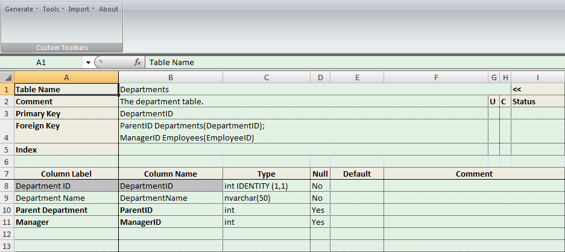

# Database Modeling Excel

## Welcome to Database Modeling Excel Project Home Page

## Screenshot

## Project

Name: Database Modeling Excel

Current release: 7.0 Production Release

Author: Yang Ning (Steven)

Please send your email to [Steven Yang](steven_nyang@outlook.com) when you have any question.

[Denote the Project](http://sourceforge.net/donate/index.php?group_id=171489)

### Description

The database modeling utility is a Microsoft Office Excel workbook which can help you to design databases.

It supports DB2, MariaDB, MySQL, Oracle, PostgreSQL, SQLite and SQL Server.

In the workbook, you can define database, generate DDL scripts, and import database definition from existing databases.

Why choose this as your database modeling utility?
The strengths of the utility are:

- Quick and easy to design database.
- More readable

Database Modeling Excel can help you to design database schema.

- Main Features
  - Supported Databases
    - DB2
    - MariaDB
    - MySQL
    - Oracle
    - PostgreSQL
    - SQL Server
    - SQLite (Only support generating DDL feature)
  - Design and maintenance database schema
  - Generate script of database schema using workbook’s content.
    - Create Tables SQL
    - Drop Tables SQL
    - Drop and Create Tables SQL
    - Create Tables IF Not Exists SQL
  - Support ignore some worksheets when generating SQL scripts
  - Import database schema from database into the workbook
  - Support automatic build process
  - Fine print (A4 paper)

## Release

The tool is available at \release\.

## For Developers

Please see [Development.md](doc/Development.md)
